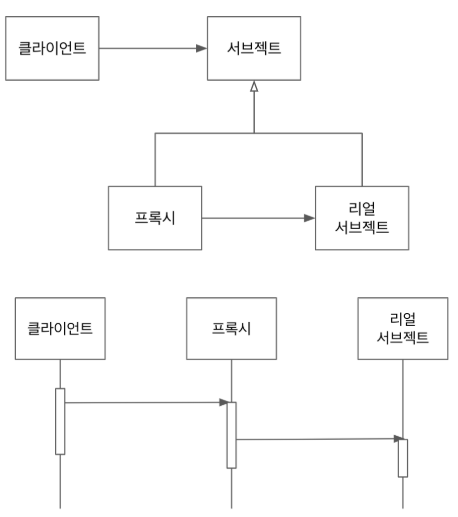
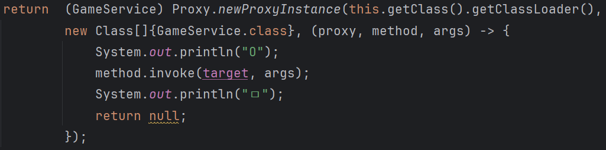

# 프록시 패턴




## 설명
- `대리`, `대리인`
- 프록시와 리얼 서브젝트과 공유하는 인터페이스가 있고 클라이언트는 해당 인터페이스 타입으로 프록시 사용
- 클라이언트는 프록시 거쳐서 리얼 서브젝트 사용하기에 
프록시는 리얼 서브젝트에 대한 접근 관리, 부가 기능, 리턴 값 변경이 가능

- 특정 객체의 오퍼레이션을 접근하기 전에 프록시 객체를 먼저 지나서 접근하는 패턴
- 클라이언트는 원래 쓰려던 클래스를 직접 쓰지 않고 프록시라는 중간 대리인을 거쳐 실행
- 맨 처음 요청은 프록시가 먼저 받는다.

## 활용
- 보안을 위한 객체 접근제어
- 많은 리소스 필요한 객체 사용될 때 생성하기 위해서 초기화 지연
    - 많은 리소스 필요하기에 미리 만들어둘 수 있지만 사용도 안하는데 생성하는 건 낭비
- 로깅
- 캐싱
    - 프록시에서 캐싱 데이터 가져오는 방법


## 장점
- 기존 코드를 변경하지 않고 새로운 기능 추가 가능 (OCP)
- 기존 코드가 변경되지 않으면서 기존 코드가 해야하는 일을 유지 가능(SRP)

## 단점
- 코드 복잡도 비교적 증가

## 다이나믹 프록시
- 런타임에 인터페이스 또는 클래스의 프록시 인스턴스 또는 클래스 만들어 사용하는 프로그래밍 기법

- 비슷한 기능을 여러 메서드에 구현, 여러 클래스에 적용하는건 번거롭고 중복 코드 많기에 이런 경우엔 다이나믹 프록시 활용 추천

- 예시
    - 스프링 데이터 JPA
    - 스프링 AOP
    - Mockito
    - hibernate

### 1) 자바에서의 동적 프록시(Proxy)
- 리플렉션 활용하여 동적 프록시(다이나믹 프록시) 제공
- 인터페이스만 가능



```
BookService bookService = (BookService) Proxy.newProxyInstance(
    BookService.class.getClassLoader()
    , new Class[]{BookService.class}
    ,  new InvocationHandler() {
        BookService bookService = new DefaultBookService();
        
        @Override
        public Object invoke(Object proxy, Method method, Object[] args) throws Throwable {
            if (method.getName().equals("rent")) {
                System.out.println("aaaa");
                Object invoke = method.invoke(bookService, args);
                System.out.println("bbbb");
                return invoke;
            }
            return method.invoke(bookService, args);
        }
    }); 
```
### 2) 스프링 AOP
- 자바 다이나믹 프록시를 유연한 구조로 개편 
- @Transactional

### 3) 클래스의 프록시
- 자바 Proxy에선 상속으로 동적 프록시 제공안함
- final class나 클래스 상속을 활용한 동적 프록시
    - CGLIB(Spring/hibernate)
    - ByteBuddy
#### 클래스 프록시의 단점
- 상속을 하지 못하는 경우 프록시 만들 수 없다.
    - final 클래스
    - 생성자 private
### → `인터페이스 동적 프록시 만들 것을 권장한다`        

