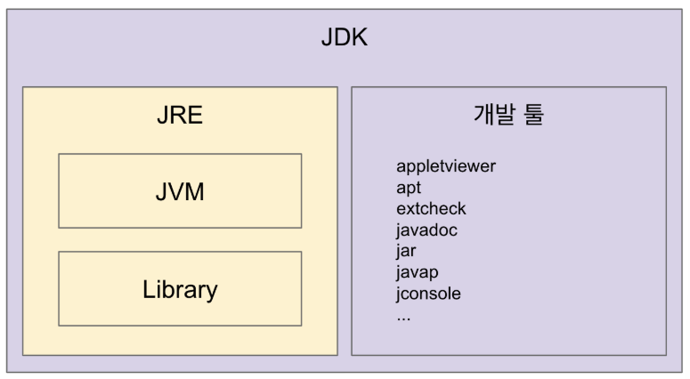
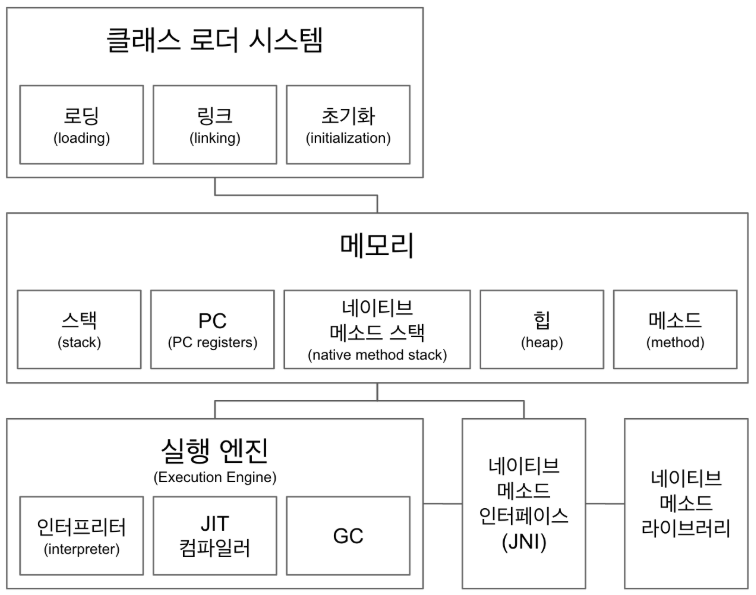
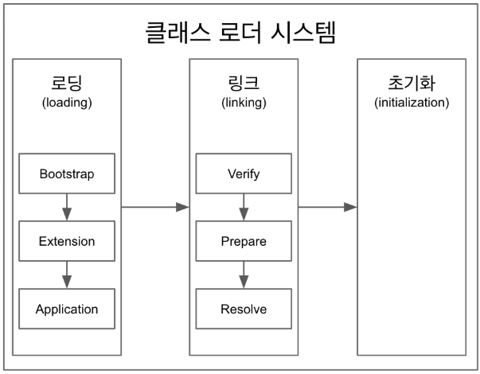

# JVM



## JVM
- 자바 가상 머신으로 자바 바이트코드 파일을 OS 특화된 코드로 변환(인터프리터, JIT 컴파일러)하여 실행
- 특정 플랫폼에 종속적

## JRE
- `JVM + 라이브러리`
- JVM과 핵심 라이브러리 및 자바 런타임 환경에서 실행되는 프로퍼티 세팅이나 리소스 파일?

## JDK
- JRE + 개발툴(javac)

## JVM 언어
- JVM 기반으로 동작하는 언어
	ex) 클로저, 그루비, JRuby, Jython, Kotlin, Scala

---
## JVM 구조


- 힙과 메소드는 공유 자원이다
- 스택, PC(PC registers), 네이티브 메소드 스택은 스레드마다 생성된다.

### 클래스로더


```
System.out.println(Main.class.getClassLoader());
System.out.println(Main.class.getClassLoader().getParent());
System.out.println(Main.class.getClassLoader().getParent().getParent());

실행 결과
jdk.internal.loader.ClassLoaders$AppClassLoader@63947c6b
jdk.internal.loader.ClassLoaders$PlatformClassLoader@4eec7777
null >> native라서 볼 수가 없음
```

#### 1) 로딩
- .class 파일을 읽고 적절한 바이너리 데이터 만들고 `메소드 영역`에 저장
- FQCN(Full Qualified Class Name)
	- ex) java.lang.String
- 클래스인지? 인터페이스? enum? 인지 
- 메소드, 변수
- 로딩이 끝나면 해당 클래스 타입의 Class 객체 생성하여 heap에 저장
```
public class Test{
	public void static main(String[] args){
		Test.class
		Test test = new Test();
		test.getClass();
	}
}
```
`Test.class로 접근이 가능`해서 static하게 접근이 가능

#### 2) 링크
- 검증 : .class 파일 유효한지 파악(바이트 코드 조작 관련)
- prepare : 클래스 변수(static 변수)와 기본 값에 필요한 메모리
- Resolve : 심볼릭 메모리 레퍼런스를 메소드 영역에 있는 실제 레퍼런스로 교체
	- 옵셔널해서 실행될 수도 있고 안될 수도 있다
```
public class Test{
	Book book = new Book();
	public void static main(String[] args){
		Test.class
		Test test = new Test();
		test.getClass();
	}
}
```
위에 Book이 있어도 실제 book를 가리는게 아닌 논리적 레퍼런스이나
heap의 실제 book을 가리키도록 실제 레퍼런스 교체하는 작업이다.
#### 3) 초기화
static 변수의 값을 할당(static 블럭도 이 떄 실행)

#### 클래스로더 계층
부트스트랩 > 플랫폼 > 어플리케이션

### 메모리 

#### 메소드(static)
- 클래스 수준의 정보(클래스 이름, 부모클래스 이름, 메소드, 변수) 저장
- 공유 자원

#### heap
- 힙은 객체를 저장 
- 공유자원

#### stack
- 스레드마다 런타임 스택을 만들고 그 안에서 스택프레임이라 부르는 블럭으로 쌓는다. 스레드 종류 시 런타임 스택도 사라진다,

#### PC registers
- 스레드마다 스레드 내 현재 실행할 스택 프레임을 가리키는 포인터 생성

#### 네이티브 메소드 스택
- 프로그램 내 네이티브 메소드가 있으면 별도로 네이티브 메소드 스택이 생성 
- 네이티브 메소드 인터페이스(JNI)로 호출하여 네이티브 메소드 라이브러리가 실행된다.

### 실행엔진
#### 인터프리터
- 바이트코드 한 줄 씩 실행

#### JIT컴파일러
- 인터프리터 효율 높이기 위해서 반복코드를 네이티브로 바꿔둔다.
- 인터프리터는 네이티브 코드로 컴파일된 코드를 바로 사용

#### JNI(Java Native Interface)
- 자바 어플리케이션에서 C, C++, 어셈블리로 작성된 함수를 사용할 수 있는 방법 제공
- Native 키워드 사용한 메소드 호출

#### 네이티브 메소드 라이브러리
- C, C++로 작성된 라이브러리
---


출처 : 백기선님 강의 "더 자바, 코드를 조작하는 다양한 방법"